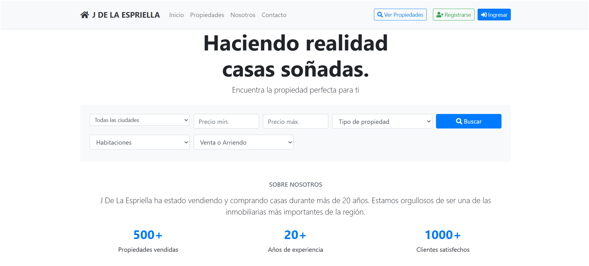
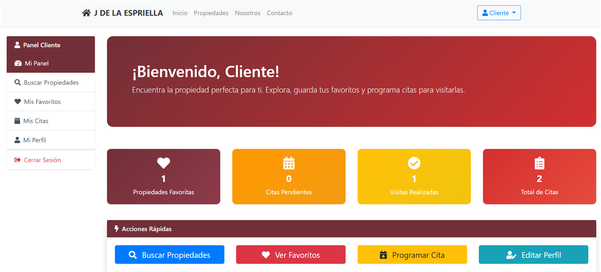
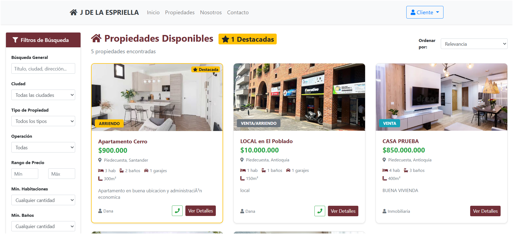

# Sistema de Gestión Inmobiliaria

## Descripción del Proyecto

Sistema web desarrollado en Java EE para la administración de una inmobiliaria, implementando metodología ágil Scrum. La aplicación permite gestionar propiedades, usuarios con diferentes roles y operaciones de búsqueda, alquiler/venta.

### Características Principales

- **Gestión de usuarios** con 4 roles diferenciados (Administrador, Usuario, Cliente, Inmobiliaria)
- **CRUD completo de propiedades** inmobiliarias
- **Sistema de búsqueda y filtrado** de propiedades
- **Gestión de citas** para visitas a propiedades
- **Diseño responsive** para dispositivos móviles
- **Landing page atractiva** con funcionalidades de búsqueda rápida

## Tecnologías Utilizadas

### Backend
- **Java EE** (Servlets + JSP)
- **JDBC** para conexión a base de datos
- **Apache Tomcat** como servidor de aplicaciones
- **MySQL** como gestor de base de datos

### Frontend
- **HTML5/CSS3**
- **Bootstrap 4.5** para diseño responsive
- **JavaScript** para interactividad
- **JSP** para contenido dinámico

## Estructura del Proyecto


## Instalación y Configuración

### Prerrequisitos

- **Java JDK 8** o superior
- **Apache Tomcat 9** o superior
- **MySQL 8.0** o superior
- **IDE** (Eclipse, IntelliJ IDEA, NetBeans)

### Pasos de Instalación

1. **Clonar el repositorio**
   ```bash
   git clone https://github.com/tu-usuario/inmobiliaria-web.git
   cd inmobiliaria-web
   ```

2. **Configurar la base de datos**
   ```sql
   -- Crear la base de datos
   CREATE DATABASE inmobiliaria_db;
   USE inmobiliaria_db;
   
   -- Ejecutar script de estructura
   SOURCE database/schema.sql;
   
   -- Cargar datos de prueba (opcional)
   SOURCE database/data.sql;
   ```

3. **Configurar conexión a BD**
   
   Editar el archivo `src/main/java/com/inmobiliaria/utils/DatabaseConnection.java`:
   ```java
   private static final String URL = "jdbc:mysql://localhost:3306/inmobiliaria_db";
   private static final String USERNAME = "tu_usuario";
   private static final String PASSWORD = "tu_password";
   ```

4. **Desplegar en Tomcat**
   - Importar proyecto en tu IDE
   - Configurar servidor Tomcat
   - Desplegar aplicación
   - Acceder a `http://localhost:8080/Inmobiliaria`

## Usuarios de Prueba

| Rol | Email | Password |
|-----|-------|----------|
| Administrador | admin@inmobiliaria.com | admin123 |
| Inmobiliaria | agente@test.com | agente123 |
| Cliente | cliente@test.com | cliente123 |

## Funcionalidades por Rol

### Administrador
- ✅ Gestionar usuarios (CRUD completo)
- ✅ Ver reportes del sistema
- ✅ Configuraciones generales
- ✅ Acceso a todas las funcionalidades

### Inmobiliaria/Agente
- ✅ Gestionar propiedades (agregar, editar, eliminar)
- ✅ Ver solicitudes de citas de clientes
- ✅ Gestionar estado de propiedades
- ✅ Generar reportes de ventas/alquileres

### Cliente
- ✅ Buscar y filtrar propiedades
- ✅ Ver detalles de propiedades
- ✅ Solicitar citas para visitas
- ✅ Gestionar perfil personal

### Usuario (No registrado)
- ✅ Ver landing page
- ✅ Búsqueda básica de propiedades
- ✅ Registrarse en el sistema

## Base de Datos

### Diagrama Entidad-Relación

```
[Usuario] ──┐
           │
           ├── [Propiedad] ── [Cita]
           │
           └── [Roles]
```

### Tablas Principales

- **usuarios**: Información de usuarios y roles
- **propiedades**: Catálogo de inmuebles
- **citas**: Solicitudes de visitas
- **tipos_propiedad**: Clasificación de inmuebles

## Metodología Scrum Aplicada

### Sprints Realizados

| Sprint | Duración | Objetivo Principal |
|--------|----------|-------------------|
| Sprint 1 | 7 días | Autenticación y roles básicos |
| Sprint 2 | 7 días | Gestión de propiedades y búsqueda |
| Sprint 3 | 7 días | Sistema de citas y refinamiento |

### Product Backlog

Ver documentación completa en [`docs/scrum/product-backlog.md`](docs/scrum/product-backlog.md)

### User Stories Implementadas

- [x] Landing page atractiva con búsqueda
- [x] Registro y login de usuarios
- [x] Dashboard personalizado por rol
- [x] CRUD de propiedades
- [x] Sistema de búsqueda y filtros
- [x] Gestión de citas/visitas
- [x] Administración de usuarios

## Capturas de Pantalla

### Landing Page


### Dashboard Cliente


### Gestión de Propiedades


## Testing

### Casos de Prueba Ejecutados

- ✅ Registro de usuarios con validaciones
- ✅ Login con credenciales correctas/incorrectas
- ✅ Redirección por roles
- ✅ CRUD de propiedades
- ✅ Búsqueda y filtrado
- ✅ Solicitud de citas
- ✅ Responsive design

## Limitaciones Conocidas

- Base de datos solo local (MySQL)
- Subida de imágenes limitada a URLs
- Sin notificaciones por email
- Validaciones básicas del lado servidor

## Futuras Mejoras

- [ ] Implementación de base de datos online
- [ ] Sistema de notificaciones
- [ ] Subida de imágenes con FileUpload
- [ ] API REST para móviles
- [ ] Integración con mapas
- [ ] Sistema de pagos

## Contribución

Este proyecto fue desarrollado como parte del parcial de Programación Java - Primer Corte.

**Estudiante:** Dana Valentina Pacheco Sandoval  
**Programa:** Tecnología en Desarrollo de Sistemas Informáticos  
**Documento:** 1102353342  
**Fecha:** Septiembre 2025  

## Licencia

Este proyecto es de uso académico exclusivamente.


---

**Nota:** Este sistema fue desarrollado siguiendo metodología Scrum con fines educativos. Toda la documentación del proceso se encuentra en la carpeta `docs/scrum/`.